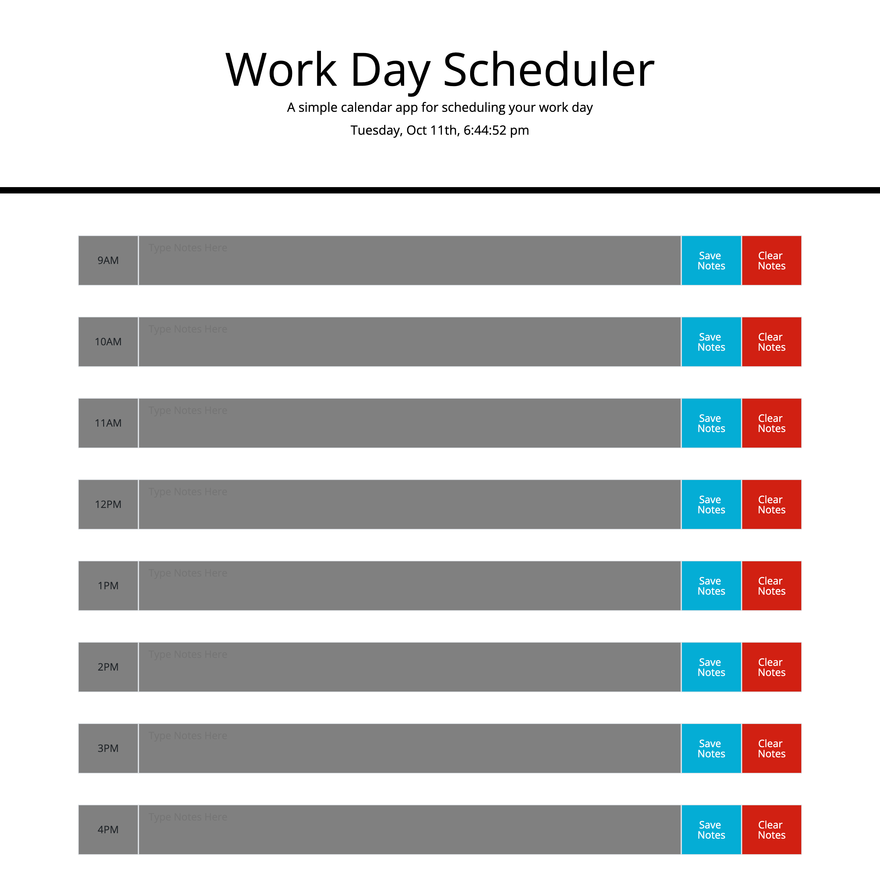

# Work-Day-Scheduler
 
## Description

- My motivation for this project was to apply the skills, knowledge, and tools learned on class related to Jquery and Bootstrap.
- I built this project with the intention of putting in practice my ability to use JQUERY and Bootstrap to design an interactive work day scheduler for daily activities.
- The code was created to show some HTML, proper CSS styling elements, JQUERY, and Bootstrap libreries
- I learned how to properly use JQuery and Bootstrap libreries to provide logic and style to the work day scheduler.

## Installation

N/A

## Usage
- Try it out:
https://joseobm92.github.io/Work-Day-Scheduler/

## Credits

N/A

## License

N/A

